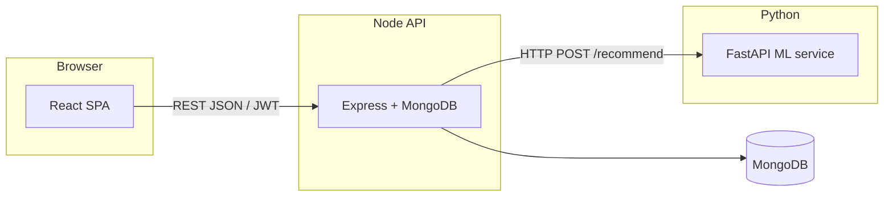

# System architecture

## Overview

The application follows a **modular monolith + ML microservice** pattern suitable for a university or portfolio MERN project, with a clean path to split services further later.

## Components

- **React (Vite) frontend**: Authentication, catalog browsing, cart, eco-points display, recommendation feed with tunable **eco weight**.
- **Express backend**: REST API, JWT auth, MongoDB models for users, products, orders, feedback; session store in MongoDB for future session analytics; proxies recommendation requests to Python.
- **FastAPI ML service**: Builds a **hybrid feature matrix** (content TF‑IDF + normalized eco-score), combines **user preference vector** from history and session events with **cosine similarity**, returns ranked product IDs and scores.

## Data flow

1. **Anonymous user**: Session events can still be written when product endpoints require optional auth; recommendations use catalog-wide signals and session touches if present.
2. **Authenticated user**: Purchase history and ratings feed the preference vector; eco-weight boosts greener items within similar content neighborhoods.

## Phase alignment

| Phase | In this repo |
|-------|----------------|
| 1 | MongoDB schemas, React shell, demo seed |
| 2 | Express routes, JWT, session middleware |
| 3 | Python hybrid scorer (extensible to full CF matrix) |
| 4 | Eco-points + mock checkout (replace with gateway) |
| 5 | Tests, CI, deployment (add as needed) |
